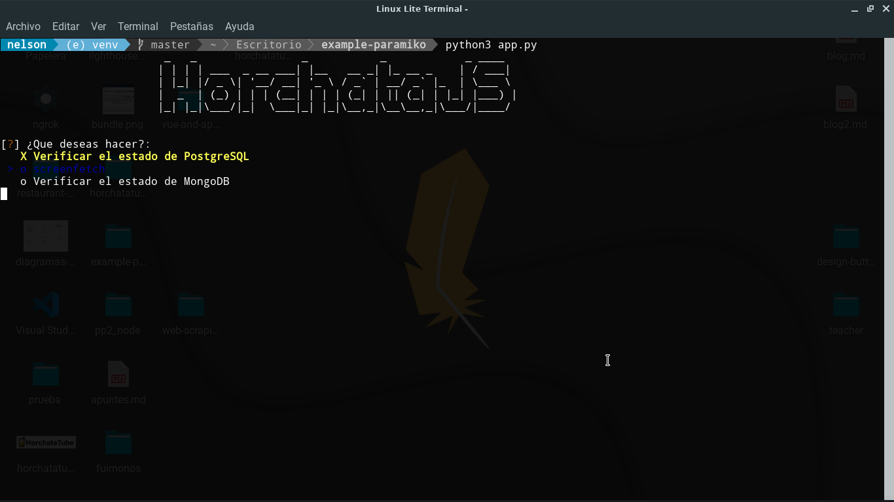

<p align="center">

</p>

<p align="center">
Ejemplo de automatización de procesos en un servidor via <b>SSH</b> con <b>Linux</b>
</p>

#### Herramientas utilizadas

* [Paramiko](http://www.paramiko.org/)
* [inquirer](https://pypi.org/project/inquirer/)
* [pyfiglet](https://pypi.org/project/pyfiglet/)
* [Caché](https://docs.python.org/3/library/functools.html)


#### Ejecuta el proyecto
```python
virtualenv venv

source ./venv/bin/activate

python3 app.py
```

## :memo: License

Licensed under the [MIT License](./LICENSE).
